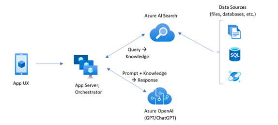

# Semantic KernelとAzure AI Searchのベクターストアを利用したRAGパターンの構築

## 1. はじめに

ここでは、[Azure AI Search での取得拡張生成 (RAG) : Microsoft Learn](https://learn.microsoft.com/ja-jp/azure/search/retrieval-augmented-generation-overview)に記載されている下記のパターンに倣ってシステムを構築していきます。

### Azure AI Search のカスタム RAG パターン
> パターンの大まかな概要は次のとおりです。
>
> 1. ユーザーの質問または要求 (プロンプト) から始めます。
> 2. Azure AI Search に送信して、関連情報を見つけます。
> 3. 上位の検索結果を LLM に返します。
> 4. LLM の自然言語理解と推論機能を使用して、最初のプロンプトに対する応答を生成します。
> 
> Azure AI Search が LLM プロンプトに入力を提供しますが、モデルのトレーニングはしません。  RAG アーキテクチャでは、追加のトレーニングはありません。 LLM はパブリック データを使用して事前トレーニングされますが、取得コンポーネント (この場合は Azure AI 検索) からの情報によって拡張された応答を生成します。
> 
> 
> - ユーザー エクスペリエンスのためのアプリ UX (Web アプリ)
> - アプリ サーバーまたはオーケストレーター (統合と調整レイヤー)
> - Azure AI Search (情報取得システム)
> - Azure OpenAI (生成 AI 用の LLM)
>
> ※ 引用元: [Azure AI Search での取得拡張生成 (RAG) : Microsoft Learn](https://learn.microsoft.com/ja-jp/azure/search/retrieval-augmented-generation-overview)
  
### Consoleアプリ & Semantic Kernel
このサンプルでは、図の「App UX」と「App Server,Orchestrator」の部分を.NETコンソールアプリケーション(C#)で代用します。コードはSemantic Kernelのクラスライブラリを利用して実装します。

### データソースはプリザンターのDB（SQL Database）
データソースには、[プリザンター](https://pleasanter.org/)に登録されたデータを利用します。

- プリザンターはAzure AppService及びAzure SQL Databaseを利用したサーバーレス構成でインストールされているものとします。
  - 参考: [インストーラでプリザンターをAzure AppServiceにサーバレス構成でインストールする](https://pleasanter.org/ja/manual/getting-started-installer-pleasanter-azure)


## 2. 取りこむデータの準備
### サンプルデータ
サンプルデータとして下記のデータをプリザンターにインポートしておきます。

- [ramen-db.csv](/ramen-db.csv)  
  (中野にあるラーメン屋のデータベースを想定した架空のデータをCopilotに作ってもらいました。実在する店舗名もありますが、あくまで架空のデータとなります)

### Viewを作成する
プリザンターの特定のテーブルからデータを取得するためのViewを作成します。
以下のSQLを使って、dbo.Resultsテーブルから必要なデータを取得し、各カラムに適切な名前を付けたViewを作成します。

今回は、「SiteId」で絞ることでプリザンターに登録されている全データから今回のサンプルデータのみをインデックス化するようにしています。

```sql
CREATE VIEW dbo.ramen
AS
SELECT
	ResultId AS ID
	, Title AS StoreName
	, Body AS Reviews
	, ClassA AS Location
	, ClassB AS Style
	, ClassC AS RecommendedMenu
	, ClassD AS Keyword
	, Title + ' ' + Body + ' ' + ClassA + ' ' + ClassB + ' ' + ClassC + ' ' + ClassD AS CombinedField
	, UpdatedTime
FROM            dbo.Results
WHERE           (SiteId = 2)

```

#### カラムの対応表
  
|テーブルのカラム名|表示名|Viewのカラム名|
|-|-|-|
|ResultId|ID|ID|
|Title|店舗名|StoreName|
|Body|口コミ|Reviews|
|ClassA|所在地|Location|
|ClassB|系統|Style|
|ClassC|おすすめメニュー|RecommendedMenu|
|ClassD|その他キーワード|Keyword|
|*|-|CombinedField|
|UpdatedTime|更新日時|UpdatedTime|

> [!Note]
> ConvinedFieldには各カラムの値を文字列結合した値を格納しておきます。このカラムはベクトル化列として利用します。
 
## 3. Azureサービスの準備
### Azure AI Searchのリソースを作成する

1. Azure Portalで "Azure AI Search" を検索し、リソースを作成します。価格レベルは評価のためFreeとしておきます。
   - リソース名: ramen-search
   - 価格レベル: Free
   - リージョン: Japan East

2. マネージドIDを有効にする
   作成したリソースに移動し、左側のメニューで"ID"を選んで「システム割り当て済み」の状態をONにしておきます

### Azure OpenAIのリソースを作成する
1. Azure Portalで "Azure OpenAI" を検索し、リソースを作成します。リージョンによって利用できないLLMがありますので必要に応じて選択してください。
   - リソース名: open-ai-searvice
   - 価格レベル: Standard(S0)
   - リージョン: Japan East

2. アクセス制御でAzure AI Searchのロールを割り当てる
   - 作成したリソースに移動し、左側のメニューで"アクセス制御(IAM)"を選びます
   - 「ロールの割り当ての追加」ボタンをクリック
   - ロールに「Cognitive Services OpenAI User」を選択
   - アクセスの割当先に「マネージドID」を選択
   - メンバーの追加でAI Search（ramen-search）のマネージドIDを選択

3. ネットワークセキュリティの構成
   必要に応じてネットワークセキュリティの構成を行います。  
   参考: [Azure OpenAI Service リソースを作成してデプロイする: Microsoft Learn](https://learn.microsoft.com/ja-jp/azure/ai-services/openai/how-to/create-resource?pivots=web-portal)

4. モデルをデプロイする  
   モデルをデプロイするには、次の手順に従います。
   
   - [Azure AI Foundry](https://ai.azure.com/) ポータルにサインインします。
   - 使用するサブスクリプションと Azure OpenAI リソースが選択されていることを確認します。
   - 左側メニューで「共有リソース」-「デプロイ」を選択します。
   - 「モデルのデプロイ」ボタンから「基本モデルをデプロイする」を選択します。
   - モデルの一覧から対象のモデルを選択肢して「確認」で内容を確認したら「リソースを作成してデプロイ」をクリックします。
  
   今回は下記の２つのモデルを使用します。
   |モデル名|用途|
   |-|-|
   |gpt-4o-mini|チャット補完|
   |text-embedding-ada-002|埋め込みモデル。データのベクトル化|


## 4. Azure AI Searchにデータをインポートする

下記ドキュメントを参考にサンプルデータのインポートとベクター化を行います。

- [マネージド ID を使用して Azure SQL へのインデクサー接続を設定する : Microsoft Learn](https://learn.microsoft.com/ja-jp/azure/search/search-howto-managed-identities-sql)
- [Azure SQL データベースのデータにインデックスを付ける : Microsoft Learn](https://learn.microsoft.com/ja-jp/azure/search/search-how-to-index-sql-database?tabs=portal-check-indexer)

### SQL Databaseへのロール割り当て
[マネージド ID を使用して Azure SQL へのインデクサー接続を設定する:Microsoft Learn](https://github.com/pleasanter-developer-community/azure-ai-rag-with-pleasanter)を参考にして、AI Searchのインスタンスに、データソースとなるSQL Databaseへの読み取り権限を付与します。

- Azure PortalでSQL Databaseサーバーのリソースに移動し、左側のメニューで"アクセス制御(IAM)"を選びます
- 「ロールの割り当ての追加」ボタンをクリック
- ロールに「閲覧者」を選択
- アクセスの割当先に「マネージドID」を選択
- メンバーの追加でAI Search（ramen-search）のマネージドIDを選択

また、Visual Studioや SQLServer Management Studio 等のツールでSQL Databaseに接続し、下記SQLでAI SearchのマネージドIDに対してデータベースへのアクセス権限を付与します。

```sql
CREATE USER [ramen-search] FROM EXTERNAL PROVIDER;
EXEC sp_addrolemember 'db_datareader', [ramen-search];
```

### データのインポートとベクター化

- Azure PortalでAI Searchのリソースへ移動し、「概要」画面上部の「データのインポートとベクター化」ボタンをクリックします。
  
 

- データへの接続
  - Azure SQLアカウントの種類：SQLデータベース
  - サーバー：(プリザンターのDBサーバー)
  - データベース: (プリザンターのDB名)
  - テーブルまたはビュー: 表示(View)
  - 認証オプションを選択する: マネージドIDを使用して認証する（システム割り当て）
  - ビューの名前: ramen
  - 変更の追跡: ☑　
    - 高ウォーターマーク変更ポリシー
    - 高基準値列：UpdatedTime


> [!Warning]
> #### 変更の追跡と高ウォーターマークポリシーの高基準値列について
> [Azure SQL データベースのデータにインデックスを付ける : Microsoft Learn](https://learn.microsoft.com/ja-jp/azure/search/search-how-to-index-sql-database?tabs=portal-check-indexer) には下記のような記載があります。
> 
> 高ウォーターマーク変更検出ポリシーは、行が最後に更新されたときのバージョンまたは時刻を取得する、テーブルまたはビューの "高基準" 列に依存します。 
> ビューを使う場合は、高ウォーターマークポリシーを使用する必要があります。 
>
> 今回はビューを利用するため、高ウォーターマーク変更ポリシーのみが利用可能となります。高基準値列にはUpdatedTimeを指定しましたが、rowversion列を指定することを強く推奨するとの事です。

- テキストをベクトル化する
  - ベクトル化する列: CombindField
  - Kind: Azure OpenAI
  - サブスクリプション: (Azure OpenAIを作成したサブスクリプション)
  - Azure OpenAI Service: (作成したAzure OpenAI名)
  - モデルデプロイ: (ベクトル化に使用するLLMモデルのデプロイ名（今回は text-embedding-ada-002）)
  


- インデックス作成のスケジュール
  - スケジュール: インデックスを更新する頻度を選択します。（今回は動作検証に利用するだけなので「一度だけ」としておきます）


- インデックスフィールド「プレビューと編集」をクリックして取り込み元のビューのカラムとインデックスフィールドとの対応を確認します。
  - ベクトル化する列に指定したCombindFieldはベクトル変換後、 text_vector というフィールド名で登録されるようです。
  - それ以外のカラムはそのまま同じ名前のインデックスフィールドに格納する設定となっています。


- オブジェクト名のプレフィックスを任意の名前に変更してインポートを実行します。この名前はこの後「インデックス名」として利用します。


インポートが完了すると、Azure AI Searchのリソースにインデックス作成されます。


## 5. セマンティックカーネルによるベクターストアを使用したテキスト検索の実装
ここからはAIサービスを利用したクライアント側の実装例を見ていきます。
サンプルでは下記のドキュメントを参考にセマンティックカーネルによるテキスト検索（RAG）の実装を行っています。

> [!WARNING]
> セマンティック カーネル テキスト検索機能はプレビュー段階であり、破壊的変更を必要とする機能強化は、リリース前の限られた状況で引き続き発生する可能性があります。

- [セマンティック カーネル テキスト検索とは](https://learn.microsoft.com/ja-jp/semantic-kernel/concepts/text-search/?pivots=programming-language-csharp)
- [セマンティック カーネル テキスト検索でベクター ストアを使用する方法](https://learn.microsoft.com/ja-jp/semantic-kernel/concepts/text-search/text-search-vector-stores?pivots=programming-language-csharp)

### 依存ライブラリ
サンプルでは、下記のライブラリを参照しています。

|Package|説明|
|-|-|
|Microsoft.Extensions.Configuration.Binder|アプリケーション設定取得用|
|Microsoft.Extensions.Configuration.Json|アプリケーション設定取得用|
|Microsoft.SemanticKernel|セマンティックカーネルのライブラリ本体|
|Microsoft.SemanticKernel.Connectors.AzureOpenAI|Azure OpenAI用コネクタ|
|Microsoft.SemanticKernel.PromptTemplates.Handlebars|PromptTemplateの生成|
|Microsoft.SemanticKernel.Connectors.AzureAISearch|Azure AI Search用コネクタ（こちらはブレビュー版につき実装が大きく変わる可能性があります。）|

### アプリケーション設定
サンプルを実行するには、アプリケーション設定ファイルが必要です。プロジェクトフォルダ(azure-ai-rag-with-pleasanter)配下に `appsettings.development.json` ファイルを作成し、Azureサービスの各種設定を記入してください。
 
```json
{
  "AzureOpenAIEndpoint": "{Azure OpenAI のエンドポイント}",
  "AzureOpenAIKey": "{Azure OpenAIのキー}",
  "AzureSearchEndpoint": "{Azure AI Searchのエンドポイント}",
  "AzureSearchKey": "{Azure AI Searchのキー}",
  "ChatDeployment": "gpt-4o-mini",
  "VectorStoreIndexName": "{AI Searchのインデックス名}",
  "EmbeddingDeployment": "text-embedding-ada-002",
  "ServiceUrl": "{検索結果のLink生成に使う、プリザンターのURL}"
}
```

### コードの解説

#### ベクターストアモデルの定義
まず、下準備としてAI Searchのベクターストアに登録されているデータをC#で扱うためのモデルクラスを定義します。
各プロパティにはデータマッピング用の属性を付与します。
- VectorStoreRecordVectorAttribute: ベクトル列に付与
- VectorStoreRecordKeyAttribute: このモデルのキーとなる項目に付与
- VectorStoreRecordDataAttribute: その他、取得したいフィールドに付与

```csharp
public class Ramen
{
    [VectorStoreRecordVector]
    public ReadOnlyMemory<float> text_vector { get; init; }
        
    [VectorStoreRecordKey]
    public required string ID { get; init; }

    [VectorStoreRecordData]
    public required string StoreName { get; init; }

    [VectorStoreRecordData]
    public required string Reviews { get; init; }

    [VectorStoreRecordData]
    public required string Location { get; init; }

    [VectorStoreRecordData]
    public required string Style { get; init; }

    [VectorStoreRecordData]
    public required string RecommendedMenu { get; init; }

    [VectorStoreRecordData]
    public required string Keyword { get; init; }
}
```

#### テキスト検索結果のマッピングの定義
次に、ベクトルストアモデル(Ramenクラス)をTextSearchResultの形式に変換するためのMapperクラスを定義します。
TextSearchResultは下記のプロパティを持ちます
- Name: 取得したデータの名前
- Value: 取得したデータの内容／詳細情報
- Link: ソースとなるデータが格納されている場所(WebサイトのURLなど)

今回のサンプルでは、下記の様に値を変換しています。
- Name: StoreName（店名）
- Value: ID、StoreName以外のフィールドをJSON文字列に成型した文字列
- Link: IDを基に組み立てた、プリザンターのレコードのURL
- 
```csharp
sealed class RamenTextSearchResultMapper : ITextSearchResultMapper

{
    public TextSearchResult MapFromResultToTextSearchResult(object result)
    {
        if (result is Ramen ramen)
        {
            var valueText = $"{{Style:\"{ramen.Style}\",Reviews:\"{ramen.Reviews}\",RecommendedMenu:\"{ramen.RecommendedMenu}\",Keyword:\"{ramen.Keyword}\"}}";
            return new TextSearchResult(value: valueText) { Name = ramen.StoreName, Link = $"{ServiceUrl}/items/{ramen.ID}" };
        }
        throw new ArgumentException("Invalid result type.");
    }
}
```

#### メイン処理
プログラムの流れとしては以下の様になります
1. テキスト検索用にカスタマイズしたSemantic Kernelの構築
2. 検索結果を基にプロンプトの文字列を生成するためのテンプレートを定義
3. `kernel.InvokePromptAsync`でプロンプトを実行

```csharp
static async Task Main()
{
    //アプリケーション設定の取得
    var settings = GetAppSettings();

　　//テキスト検索用にカスタマイズしたSemantic Kernelの構築
    var kernel = CreateTextSearchKernel(settings);

    //プロンプトテンプレート構築用のファクトリクラス
    //- ここではHandlebarsテンプレートエンジンを利用
    var promptTemplateFactory = new HandlebarsPromptTemplateFactory();
    //検索結果からプロンプトを生成するテンプレートの定義
    //- <Plugin名>-<Function名> でカーネルプラグインのファンクションを呼び出し
    //- 結果を {{#each this}} で反復処理
    var promptTemplate = """
        {{#with (SearchPlugin-GetTextSearchResults query)}}  
            {{#each this}}  
            Name: {{Name}}
            Value: {{Value}}
            Link: {{Link}}
            -----------------
            {{/each}}  
        {{/with}}  

        {{query}}

        Include citations to the relevant information where it is referenced in the response.
        """;

    do
    {
        Console.WriteLine("Enter a query or type 'exit' to quit:");
        var input = Console.ReadLine();
        if (input == "exit")
        {
            break;
        }
        //コンソールに入力された文字列でプロンプトを実行
        var result = await kernel.InvokePromptAsync(
            promptTemplate,
            new KernelArguments() { { "query", input } },
            templateFormat: HandlebarsPromptTemplateFactory.HandlebarsTemplateFormat,
            promptTemplateFactory: promptTemplateFactory);

        Console.WriteLine(result);

    } while (true);
}
```

#### Semantic Kernelの構築
テキスト検索用にカスタマイズしたSemantic Kernelの構築の実装は下記の通りです。詳細はコード内のコメントをご確認ください。


```csharp
// テキスト検索用にカスタマイズしたSemantic Kernelの構築
private static Kernel CreateTextSearchKernel(AppSettings settings)
{
#pragma warning disable SKEXP0001, SKEXP0010 //Experimental(実験段階)であることの警告を非表示

    // Azure OpenAIクライアントのインスタンスを生成
    var openAiClient = new AzureOpenAIClient(
        new Uri(settings.AzureOpenAIEndpoint),
        new AzureKeyCredential(settings.AzureOpenAIKey));

    //ChatCompletionのデプロイ(gpt-4o-mini)を紐づけし、Semantic Kernelのインスタンスを生成
    var kernelBuilder = Kernel.CreateBuilder()
        .AddAzureOpenAIChatCompletion(settings.ChatDeployment, openAiClient);
    var kernel = kernelBuilder.Build();

    // Azure AI Searchのベクトルストアのインスタンスを生成
    var vectorStore = new AzureAISearchVectorStore(
        new SearchIndexClient(
            new Uri(settings.AzureSearchEndpoint),
            new AzureKeyCredential(settings.AzureSearchKey)));

    // ベクトルストアからコレクションを取得
    var collection = vectorStore.GetCollection<string, Ramen>(settings.VectorStoreIndexName);

    //テキスト埋め込み生成サービスのインスタンスを生成
    var embeddingGenarationService 
        = new AzureOpenAITextEmbeddingGenerationService(settings.EmbeddingDeployment, openAiClient);

    //VectorStoreTextSearch オブジェクトの生成
    var textSearch = new VectorStoreTextSearch<Ramen>(
        collection,
        embeddingGenarationService,
        null,
        new RamenTextSearchResultMapper(settings.ServiceUrl));

    //VectorStoreTextSearchオブジェクトからファンクション`GetTextSearchResult` を生成
    //そのファンクションを実行するカーネルプラグインを作成
    var searchPlugin = KernelPluginFactory.CreateFromFunctions(
        "SearchPlugin", "ramen search",
        [textSearch.CreateGetTextSearchResults(searchOptions: new TextSearchOptions() { Top = 10 })]);

    //プラグインをカーネルに追加
    kernel.Plugins.Add(searchPlugin);
    return kernel;

#pragma warning restore SKEXP0001, SKEXP0010
}
```

## 6. 実行結果
それでは実行してみましょう。ちゃんと登録したデータの中から、リクエストの内容に沿った回答を返してくれていますね！

```
Enter a query or type 'exit' to quit:
つけ麵のおいしいお店をおしえてください
おいしいつけ麺のお店は以下の3軒がおすすめです：

1. **つけ麺大王 中野店**
   - **スタイル**: つけ麺系
   - **レビュー**: 評判の良いつけ麺で、看板猫がかわいいです。
   - **おすすめメニュー**: 特製つけ麺
   - **キーワード**: 濃厚なつけだれ
   - [詳細はこちら](https://my-pleasanter-xxxx.azurewebsites.net/items/61)

2. **つけ麺専門店 麺道場**
   - **スタイル**: つけ麺系
   - **レビュー**: 評判の良いつけ麺です。
   - **おすすめメニュー**: 特製つけ麺
   - **キーワード**: 濃厚なつけだれ
   - [詳細はこちら](https://my-pleasanter-xxxx.azurewebsites.net/items/52)

3. **つけ麺屋 やすべえ 中野店**
   - **スタイル**: つけ麺系
   - **レビュー**: ボリューム満点で、美味しいつけ麺が楽しめます。
   - **おすすめメニュー**: 特製つけ麺
   - **キーワード**: 濃厚、つけだれ
   - [詳細はこちら](https://my-pleasanter-xxxx.azurewebsites.net/items/44)

これらのお店はそれぞれの魅力があり、特製つけ麺はどのお店でもおすすめです。ぜひ訪れてみてください！

Enter a query or type 'exit' to quit:
こってりしたラーメンが食べたいです
こってりしたラーメンをお求めでしたら、以下の選択肢があります：

1. **背脂醤油ラーメン まつもと**
   - **スタイル**: 背脂系
   - **レビュー**: 背脂たっぷり
   - **おすすめメニュー**: 背脂醤油ラーメン
   - **キーワード**: こってり、ガッツリ
   [詳細はこちら](https://my-pleasanter-xxxx.azurewebsites.net/items/55)

2. **麺処 井の庄 中野店**
   - **スタイル**: 濃厚魚介豚骨系
   - **レビュー**: 濃厚なスープが人気
   - **おすすめメニュー**: 井の庄ラーメン
   - **キーワード**: こってり、満足感
   [詳細はこちら](https://my-pleasanter-xxxx.azurewebsites.net/items/45)

これらのラーメンは、こってりとした味わいを楽しめるものとなっていますので、ぜひ試してみてください。
```
